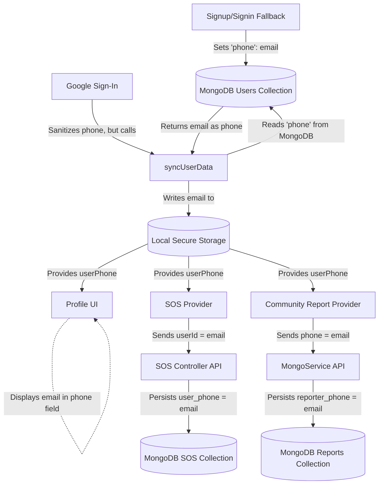

# Identity Consistency Root Cause Report

## Root Cause

The contamination originates from several overlapping flaws across the authentication and identity flows. The primary root cause is an over-reliance on `email` as a fallback identifier for `phone`, which then becomes permanently persisted in both local storage and the database. 

Specifically:

1. **Local Signup/Signin Fallback:** In `AuthProvider.dart`, if Firebase is unavailable, the fallback local signup directly assigns the user's email to the `phone` field in MongoDB (`'phone': email`) and saves it to local `StorageService` via `setUserPhone(email)`. 
2. **MongoDB Data Syncing (`syncUserData`):** During synchronization, the `syncUserData` function retrieves the `phone` field from the user's MongoDB document. If this field was previously contaminated with an email address (from legacy signups or the fallback signin), it blindly overwrites the local `user_phone` storage without validating if the string is actually a phone number.
3. **Google Sign-In Workaround is Bypassed:** `signInWithGoogle` attempts to sanitize the phone number (`dbPhone.contains('@') ? '' : dbPhone`), but immediately calls `syncUserData(email)`, which overrides the local storage with the un-sanitized database value containing the email.
4. **Backend Fallbacks:** In endpoints like `sosController.js`, `req.user.phone || req.user.email` is used as a fallback if the phone is missing, causing `email` to be directly written to the `user_phone` field of SOS documents.
5. **Accidental Key Swaps:** In several Dart repositories (`security_repository_impl.dart`, `alert_repository_impl.dart`), `_userEmail` is erroneously instantiated by calling `_storageService.getString('user_phone')`.

Because local storage propagates to the UI, the Personal Information page initializes its `_phoneController` with the contaminated `userPhone` variable. Since API calls for SOS and Community Reports pass this same `userPhone` variable to the backend, the backend persists the email into the `user_phone` and `reporter_phone` fields.

## Affected Files

**Flutter Frontend:**
- `lib/features/auth/presentation/providers/auth_provider.dart`: Contains the flawed logic that assigns and syncs emails to the `phone` field.
- `lib/features/security/data/repositories/security_repository_impl.dart`: Erroneously uses `user_phone` to retrieve `_userEmail`.
- `lib/features/alerts/data/repositories/alert_repository_impl.dart`: Erroneously uses `user_phone` to retrieve `_userEmail`.
- `lib/core/services/mongo_service.dart`: Community report logic maps `phone` to `reporter_phone` without validation.
- `lib/features/sos/presentation/providers/sos_provider.dart`: Sends the contaminated `userPhone` as `userId` during SOS trigger.

**Node.js Backend:**
- `backend/src/controllers/sosController.js`: Maps `user_id` to `phone` and explicitly checks `req.user.phone || req.user.email` for ownership, accepting emails in the phone field.
- `backend/src/controllers/contactController.js`: Contact endpoints use `req.user.phone !== userPhone && req.user.email !== userPhone` logic that perpetuates email/phone mixing.

## Data Flow Diagram

## Exact Fix Strategy

1. **Sanitize Data on Read (`AuthProvider.dart`)**: 
   - Update `syncUserData` to strip emails from the `phone` field. Do not execute `await _storageService.setUserPhone(phone);` if `phone.contains('@')`.
   - Ensure the fallback `signUp` and `signIn` do not assign `email` to the `phone` variable/field.
2. **Remove Email Fallbacks for Phones (`sosController.js` / Frontend)**:
   - Ensure the backend explicitly rejects SOS triggers or Contact creations if the `phone` variable contains an `@`. 
   - Ensure `req.user.phone` is the only authorized field for phone identity checking.
3. **Fix Repository Key Mismatches**:
   - In `security_repository_impl.dart` and `alert_repository_impl.dart`, change `_storageService.getString('user_phone')` to `_storageService.getString(AppConstants.keyUserEmail)`.

## Legacy Data Impact

Because the system has been running with this logic, there is legacy data contamination in MongoDB:
- **`users` collection**: Existing users may have an email address stored in the `phone` field.
- **`sos_history` / `s_o_s` collection**: Old SOS documents possess `user_phone` values containing emails.
- **`community_reports` collection**: Old reports possess `reporter_phone` values containing emails.
- **`emergency_contacts` collection**: May have skewed `user_phone` keys.

Fixing the application logic will prevent future contamination, but a one-time backend data migration script will be necessary to nullify or resolve emails sitting in legacy `phone` fields across these collections.

## Verification Plan

1. **Local State Verification**: Create a fresh user via email/password, then via Google Login. Assert via logging that `userPhone` remains empty (`""`) and is not populated with the email.
2. **UI Verification**: Navigate to the Personal Information page and verify the phone field is visibly empty instead of showing the user's email.
3. **Database Verification**: Trigger an SOS and create a Community Report. Inspect the resulting documents in MongoDB to ensure `user_phone` and `reporter_phone` are not emails.
4. **Regression Verification**: Ensure that the fix in `security_repository_impl.dart` accurately fetches the email and doesn't break security modules that depend on `_userEmail`.
